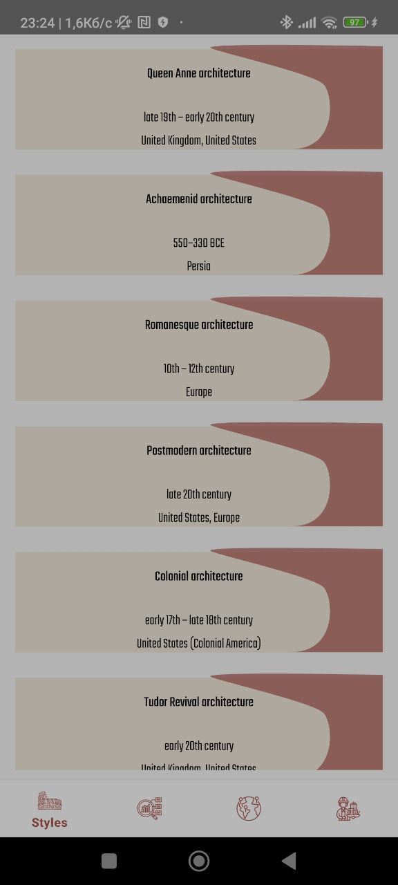
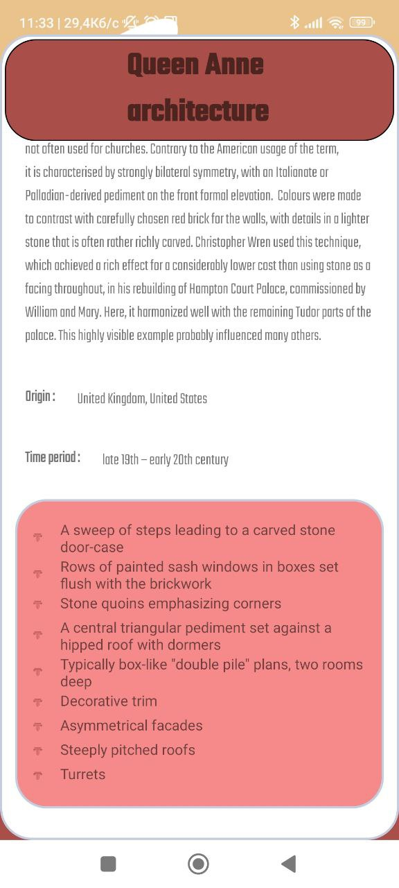
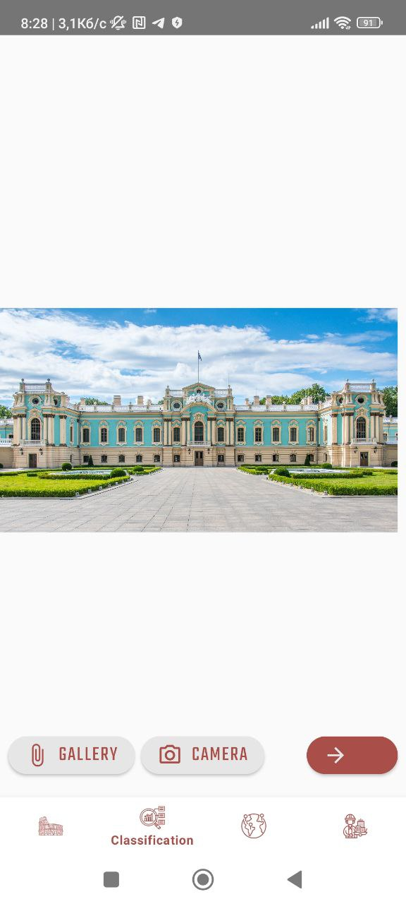

# Architectural Style Classification Mobile App

Deep learning system and Android application for classifying architectural styles of buildings from images.
The project focuses on building a lightweight and efficient neural network suitable for mobile devices, allowing users to detect architectural styles directly from their phone.

---

# Key Highlights :

• Android mobile application for architectural style recognition  
• Deep learning image classification model  
• 51 architectural styles including Ukrainian architecture  
• 18,112 images dataset collected and curated manually  
• Optimized for mobile deployment (model size vs accuracy trade-off)  
• 🎯 Final accuracy: 65.4%**

---

# Application Demo

Example workflow:

1. User captures or uploads a building photo  
2. Model performs architectural style classification  
3. Application displays predicted style and related information  

---

# Implementation Details

The project consists of two main components: a machine learning pipeline and a mobile application.

## Machine Learning Pipeline

The model training and data pipeline were implemented using Python and deep learning frameworks.

**Technologies**

- Python
- TensorFlow
- Keras
- NumPy
- Pandas
- OpenCV
- Matplotlib / visualization tools

**Pipeline stages**

1. Data collection from multiple sources
2. Automatic dataset cleaning
3. Manual dataset filtering
4. Model training and evaluation
5. Handling imbalanced classes
6. Model optimization and postprocessing
7. Exporting trained model for mobile deployment

---

## Mobile Application

The trained model was integrated into an Android application that allows users to classify architectural styles directly from photos.

**Technologies**

- Kotlin
- Android SDK
- Firebase

**Firebase services used**

- Firebase Authentication 
- Firebase Storage
- Firebase Realtime Database / Firestore
- Firebase ML Custom Model 

## Model Training Summary

| Model | Model Size | Train Accuracy | Validation Accuracy | Test Accuracy |
|------|------------|---------------|--------------------|--------------|
| ResNet50 | 98.2 MB | 91.7% | 63.4% | 62.9% |
| EfficientNetV2B0 | 50.7 MB | 81.9% | 63.0% | **65.4%** |
| MobileNetV2 | 15.4 MB | 73.1% | 60.0% | 59.4% |

EfficientNetV2B0 provided the best **balance between model size and classification performance**, making it the most suitable architecture for mobile deployment.

## Postprocessing Experiments

| Method | Train Accuracy | Validation Accuracy | Test Accuracy | Train Loss | Validation Loss | Test Loss |
|------|------|------|------|------|------|------|
| CSAM + Reduce on Plateau | 66.9% | 56.1% | 57.5% | 0.19 | 0.26 | 0.26 |
| **CSAM + Adaptive Learning Rate Decay** | **81.9%** | **63.0%** | **65.4%** | **0.06** | 0.21 | 0.23 |
| CSAM + Adaptive LR Decay + MLLR | 74.0% | 60.11% | 61.0% | 0.11 | 0.13 | 0.14 |

The best performance was achieved using **CSAM with adaptive learning rate decay**, which improved the model's ability to focus on relevant visual features while stabilizing the training process.
This configuration produced the highest **test accuracy (65.4%)** while maintaining a compact model suitable for mobile deployment.
